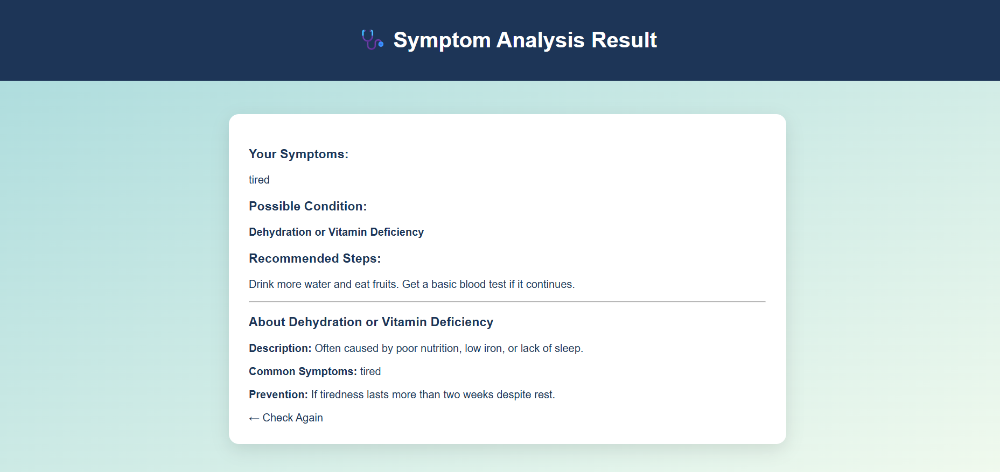

# Healthcare-Symptom-Checker

A simple **Flask + SQLite** based web application that allows users to input symptoms and get **probable conditions** and **recommended steps** (for **educational purposes only**).

# Features

**Symptom Checker:**  
  Input common symptoms (like fever, cough, nausea) and get possible conditions with recommendations.
**No Internet or API Key Needed:**  
  Works completely offline once installed.
**Educational Only:**  
  Displays a clear disclaimer that this tool is **not a medical diagnosis system**.

## Project Structure
│
├── app.py # Main Flask backend
├── hospital.db # SQLite database (auto-created)
├── static/ # CSS, JS, and images
│ ├── style.css
│ └── script.js
├── templates/ # HTML files
│ ├── index.html
│ ├── result.html 
│ └── history.html
├── README.md # Project documentation
└── requirements.txt # Dependencies

## Screenshots:

## Future Improvements
-> Add login system for doctors/patients

-> Store symptom check history

-> Show health trends or reports

-> Deploy on Render/Heroku

## Author
-> jadarishika@gmail.com
-> https://github.com/Rishika282005

## License
-> This project is licensed under the MIT License – you’re free to use, modify, and distribute with attribution.

  

